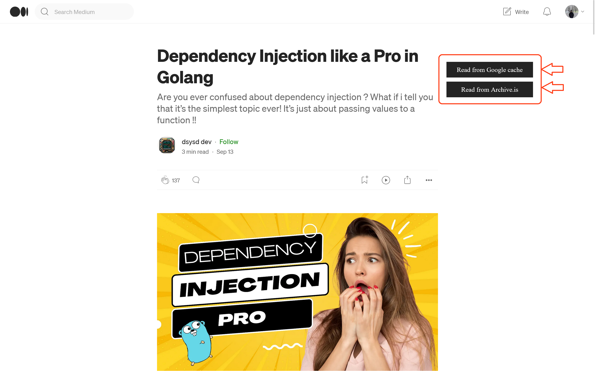

  

<h1 align="center">Medium Parser</h1>

*Medium parser is a web browser extension to help read the member-only articles on medium.com*

## Installation Instructions
### Google Chrome / Microsoft Edge / Chromium Browsers (Brave/Opera Mini) (Custom sites supported) 
 

 

Or install manually
1. Download this repo as a [ZIP file from GitHub](https://github.com/Xatta-Trone/medium-parser-extension/archive/refs/heads/main.zip).
1. Unzip the file and you should have a folder named `medium-parser-extension-main`.
1. In Chrome/Edge go to the extensions page (`chrome://extensions` or `edge://extensions`).
1. Enable Developer Mode by clicking the toggle button on the top right side of the browser.
1. Drag the `medium-parser-extension-main` folder anywhere on the page to import it (do not delete the folder afterward).

### Mozilla Firefox (Custom sites not supported) 
 

 

### Troubleshooting
* This extension pulls the data from `webcache.googleusercontent.com`; then removes all the scripts and sends back the html and css contents only. It might not work when there is no data from the request. 
* For [archive.is](https://archive.is/), it simply redirects you with the data. 

### Credits / Ideas
*  [This article on reddit.com](https://www.reddit.com/r/ChatGPT/comments/138jt64/you_can_read_medium_articles_for_free_using_bing/)
## Preview

  

### Updates
#### 1.3.2
Changed logo

Change archive.is to archive.today for better proxy support
#### 1.3.0
Added 3rd party API proxy support.

Added disclaimer message with the buttons. 
#### 1.2.0
Added support for [https://archive.is/](https://archive.is/)
#### 1.1.1
Removed dependency on the 3rd party server. Now you can directly read form the Google Web Cache
#### 1.1.0

Added support for all medium.com based websites such as: 
- https://medium.com 
- https://towardsdatascience.com

### 1.0.1
Minor fixed and updates.
