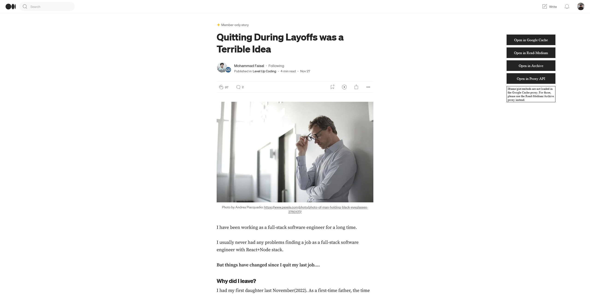

  

<h1 align="center">Medium Parser</h1>
*Medium parser is a web browser extension to help read the member-only articles on medium.com and medium.com-based sites (e.g. towards-data-science)*

### 15th February 2024: The extension was taken down by the Chrome Web Store (40k+ DAU).
### 25th February 2024: Uploaded a new version to the Chrome Web Store.
### 8th September 2024: The extension was taken down by the Chrome Web Store (30k+ DAU).

## Installation Instructions
### Google Chrome / Microsoft Edge / Chromium Browsers (Brave/Opera Mini/Thorium etc.)
 

Or, Install manually
1. Download this repo as a [ZIP file from GitHub](https://github.com/Xatta-Trone/medium-parser-extension/archive/refs/heads/main.zip).
1. Unzip the file and you should have a folder named `medium-parser-extension-main`.
1. In Chrome/Edge go to the extensions page (`chrome://extensions` or `edge://extensions`).
1. Enable Developer Mode by clicking the toggle button on the top right side of the browser.
1. Drag the `chrome` folder anywhere on the page to import it (do not delete the folder afterward).

### Mozilla Firefox
 

 

### Troubleshooting
* This extension pulls the data from `webcache.googleusercontent.com`; then removes all the scripts and sends back the html and css contents only. It might not work when there is no data from the request. 
* For [archive.is](https://archive.is/), it simply redirects you with the data. 

### Credits / Ideas
*  [This article on reddit.com](https://www.reddit.com/r/ChatGPT/comments/138jt64/you_can_read_medium_articles_for_free_using_bing/)

### Support 
Please consider a donation if you find this extension helps you daily.
Your contribution allows me to spend more time making this kind of extension/project.

 

## Preview

  

## Star History

